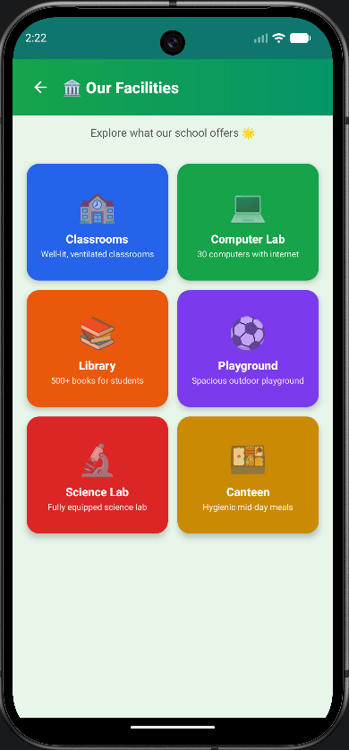

# 🏫 Shale-Namma Pride

> 🚀 A smart government school transparency app built using Kotlin, Firebase, and Gemini AI.

<p align="center">
  
</p>

---

## ✨ Overview

Shale-Namma Pride is an Android application designed to improve communication and transparency between government schools and parents.

The app allows schools to share:
- 🍛 Daily meal updates
- 🏫 School facilities
- 🌟 Student achievements
- 💬 Parent feedback

The project also integrates **Gemini AI** for Kannada translation support.

---

# 📱 App Preview

| Home Screen | Features |
|---|---|
|  |  |

---

# 🔥 Features

✅ Beautiful child-friendly UI  
✅ Firebase Authentication  
✅ Daily Meal Upload System  
✅ Facilities Gallery  
✅ Student Stars Section  
✅ Parent Feedback System  
✅ Gemini AI Kannada Translation  
✅ Modern Dashboard Layout  

---

# 🧠 AI Integration

This project uses **Google Gemini API** to translate school updates from English to Kannada.

### Example

| English | Kannada |
|---|---|
| Today's meal is rice and sambar | ಇಂದಿನ ಊಟ ಅನ್ನ ಮತ್ತು ಸಾಂಬಾರ್ |


  
  
  
  


---

# 🛠️ Tech Stack

| Technology | Purpose |
|---|---|
| Kotlin | Android Development |
| XML | UI Design |
| Firebase Auth | Authentication |
| Firestore | Database |
| Firebase Storage | Image Storage |
| Gemini API | AI Translation |
| Retrofit | API Calls |

---

# 📂 Project Structure

```bash
app/
│
├── activities/
├── adapters/
├── api/
├── models/
├── utils/
└── res/
```

---

# 🚀 Setup Instructions

### 1️⃣ Clone Repository

```bash
git clone https://github.com/your-username/Shale-Namma-Pride.git
```

### 2️⃣ Open in Android Studio

### 3️⃣ Connect Firebase
- Enable Authentication
- Enable Firestore
- Enable Storage

### 4️⃣ Add `google-services.json`
Place inside:

```bash
app/google-services.json
```

### 5️⃣ Add Gemini API Key

Add your API key inside:

```bash
GeminiApiService.kt
```

### 6️⃣ Run the App 🎉

---

# 🎯 Project Objective

The main objective of this project is to:
- Improve school transparency
- Increase parent engagement
- Promote government schools digitally
- Showcase GenAI integration in education

---

# 🌈 UI Highlights

- Modern colorful cards
- Smooth dashboard design
- Student-friendly appearance
- Simple navigation flow

---

# 📌 Future Enhancements

- Push Notifications
- Attendance Tracking
- Voice Announcements
- Multi-language Support
- School Event Calendar

---

# 👨‍💻 Developed By

## Ramanand
Computer Science Engineering Student

---

# ⭐ Support

If you like this project, give it a ⭐ on GitHub!
